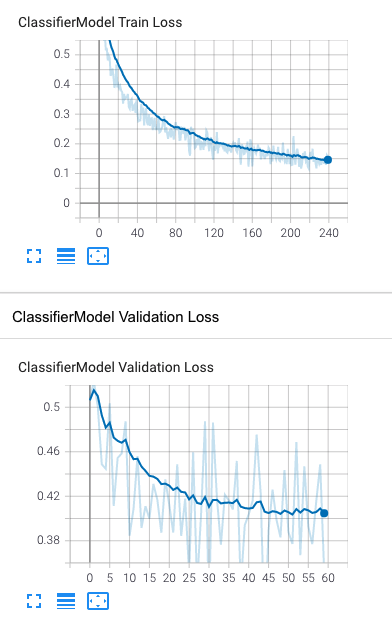
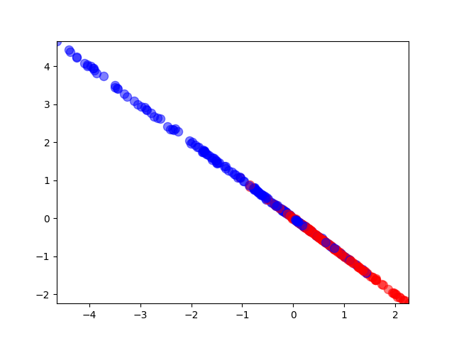
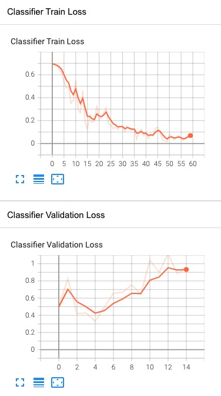
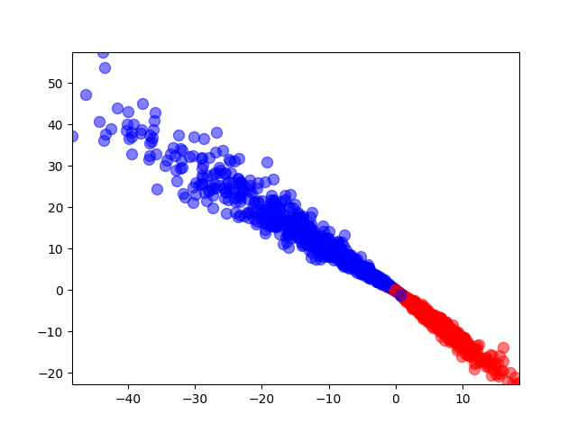
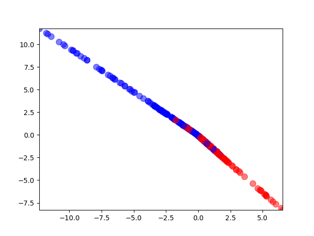
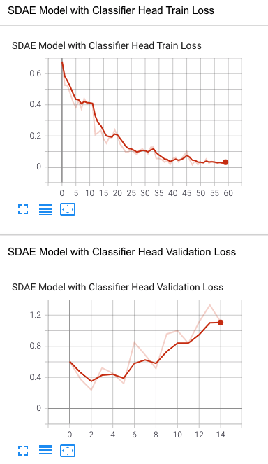
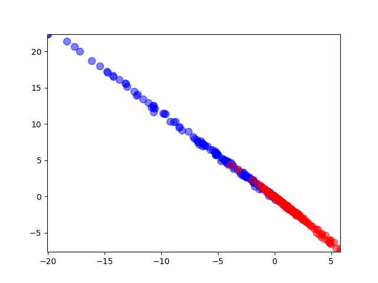

## Novel Molecular Toxicity Prediction Model

Novel molecular toxicity prediction model based on Softmax / Deep Neural Network / Stacked Autoencoder / Stacked Capsule Model.

| Model Name | Recall | Precision  | F1 | AUC | Accuracy | SE | SP
| :----: | :----: | :----: | :----: | :----: | :----: | :----: | :----: |
| Softmax Model | 0.7235 | 0.8601 | 0.7859 | 0.8100 | 0.8154 | 0.7235 | 0.8964 |
| DNN+Softmax Model | 0.7882 | 0.8221 | 0.8048 | 0.8190| 0.8209 | 0.7882 | 0.8497 |
| SAE+Softmax Model | 0.7706 | 0.8562 | 0.8111 | 0.8283 | 0.8320 | | |
| SAE+CapsNets Model | 0.7353 | 0.8621 | 0.7937 | 0.8158 | 0.8209 | | |

### 数据编码预处理

在对化合物分子毒性预测，每种分子作为一条单独数据样本在送入预测模型前，我们首先需要对字符形式分子式进行编码，实现对每个分子式的唯一表征，用以输入分类模型做毒性预测。

CSPY连通子图分子指纹模块将字符分子式转成ArrayList数值列表，然而数值列表存在数值大且维度不一致问题，无法直接送入模型训练和预测。我们采用稀疏编码方式将分子的数值列表编码到的固定维度的表示。
最后将训练和验证集的分子数据封装成可直接输入模型的分子数据加载器。

基于上文所述，实现分子指纹生成器和分子数据加载器。

- 分子指纹生成器

分子指纹生成器用于将字符串分子式编码成为维度统一的高纬度稀疏向量，包含数值列表生产器，高纬词频字典和稀疏特征编码选择器。

分子数值列表生产器将百万级全集字符串分子式生成全量分子数值列表，形如String字符串分子式"C1C=CC2C3CC(C=C3)C12" -> ArrayList数值列表[10096711892670890447, ..., 1009866219365390731, 10100282728267757615]；
对产生的ArraryList数值列表做词频统计并基于频率字段做降序排序，形如[(1763725584049666355, 1796776), (735972946868555642, 1697441), ..., (14724364211453207244, 2), (18185386034216900590, 1)]。超高频
与超低频的数值特征对模型的预测意义较低，通过upper与lower阈值参数进行特征选择，进而生成数值词频字典，数值词频字典的大小即为稀疏编码的维度；遍历训练和验证集的ArrayList数值列表，将数值散列到词频字典维度的零向量中，出现的位置设置
为1，形如ArrayList数值列表[10096711892670890447, ..., 1009866219365390731, 10100282728267757615] -> 稀疏编码[0, 0, 1, 1, ..., 0, 1, 0]）

- 分子数据加载器

分子数据加载器CSFPDataloader用于对编码到固定维度的稀疏数据进行划分，批处理，shuffle打散以及多线程加载，进而封装成为模型可以直接读取训练和预测的形式。

### 1. Softmax Model

- loss

- validationset classification

### 2. DNN+Softmax Model

- loss

- trainset classification

- validationset classification

### 3. SAE+Softmax Model

- loss

- validationset classification

### 4. SAE+CapsNets Model

### Reference

- Sara Sabour, Nicholas Frosst, and Geoffrey E. Hinton. Dynamic routing between capsules. In NIPS, pages 3859-3869, 2017.

- [Capsule Networks Explained](https://kndrck.co/posts/capsule_networks_explained/?nsukey=T%2FHdvRcjUBfihkYW23QZW0A8Q%2BljC4XZ9xJ0fVl2CVMEplz%2F1PwPluHYtS%2FUUxitMi%2BroERqd7kohaw8wXNUYmJUzpRpzSz6sud35oxMViGrNEpilQ7i3%2BPynLRiLYP6IEd7tmfNSkYGb%2F2vn4J4pnIht3tu6lihLD6vwQ7frfIQvDI8G3K0f1ILzbiFWx%2FV4%2BYufwFyWlyf9ypf7TDd1g%3D%3D)

- Wang, Y.-W., Huang, L., Jiang, S.-W., Li, K., Zou, J., & Yang, S.-Y. (2020). CapsCarcino: A novel sparse data deep learning tool for predicting carcinogens. Food and Chemical Toxicology, 135, 110921.

- [http://www.jerrylsu.net/articles/2021/ml-Capsule-Networks.html](http://www.jerrylsu.net/articles/2021/ml-Capsule-Networks.html)